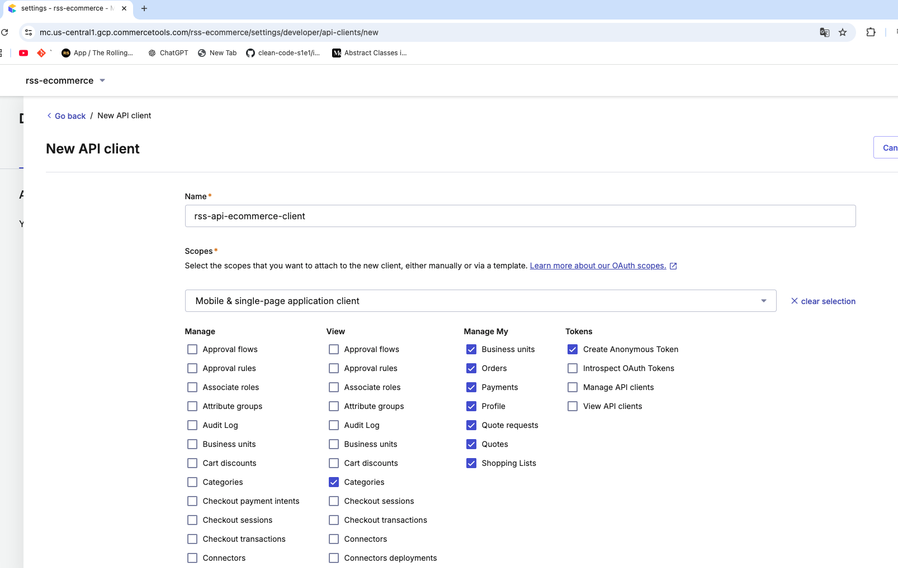
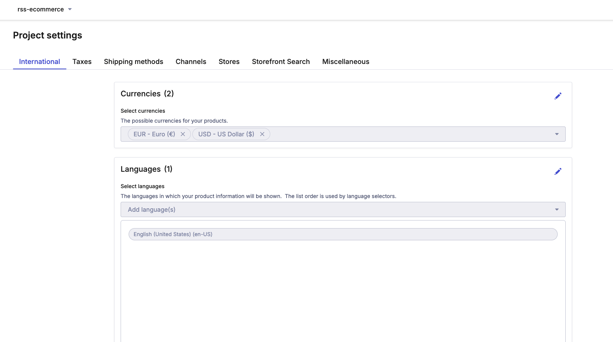
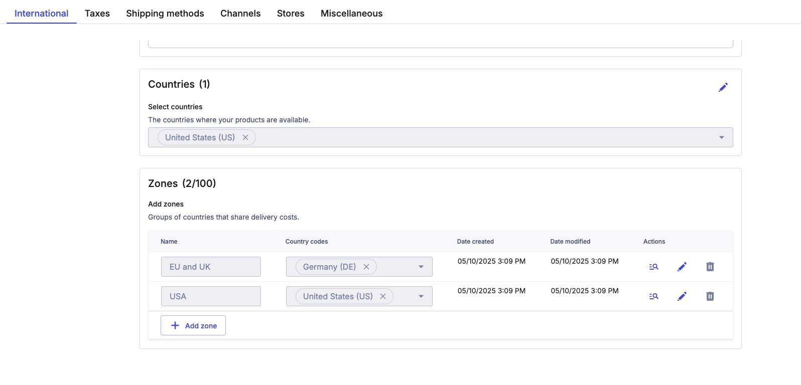
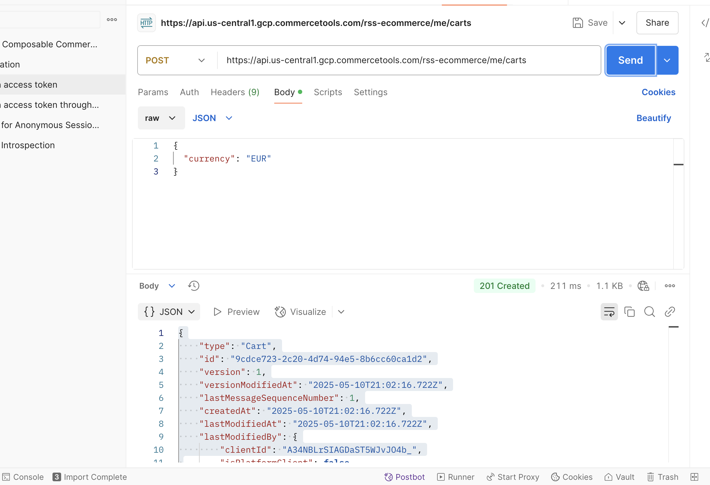
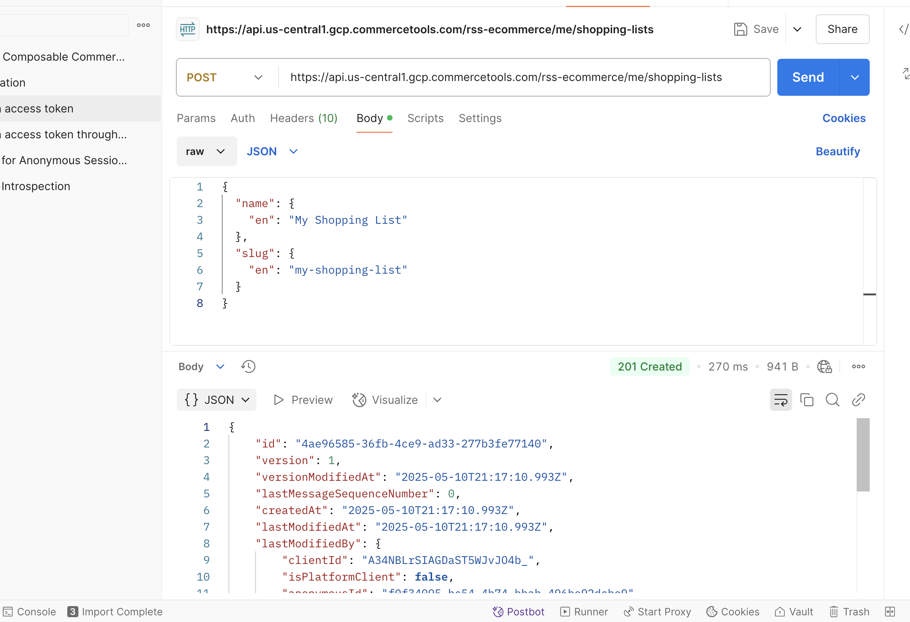
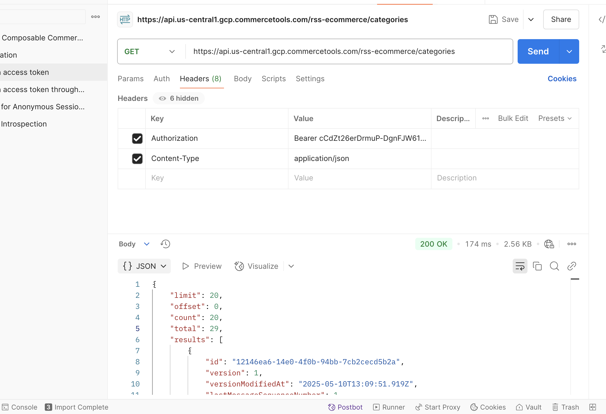
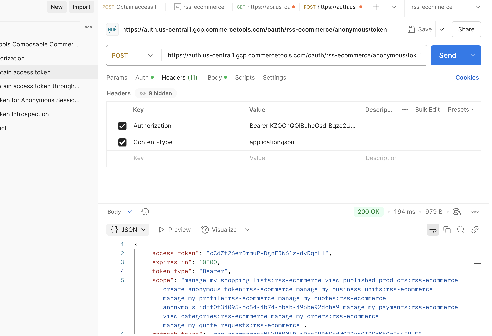
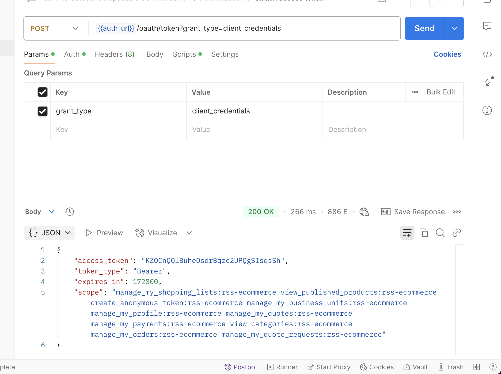

# 🛍️ RSS E-Commerce Task

This is the final project for the [RS School Frontend Course](https://rs.school/) — a fully functional, single-page **E-Commerce web application** built with **React** and **Webpack**

## Getting Started
1. Install [Node.js](https://nodejs.org/en)
2. Clone this repository
3. Use `npm install` to install all dependencies
4. Run `npm start` to open project in your browser

## 📜 Available Scripts

The following NPM scripts are available for development and maintenance:

| Command             | Description                                              |
|---------------------|----------------------------------------------------------|
| `npm start`         | Start dev server with Hot Module Replacement (HMR)       |
| `npm run dev`       | Build the project in development mode                    |
| `npm run prod`      | Build the project in production mode                     |
| `npm run lint`      | Run ESLint on `.ts` and `.tsx` files                     |
| `npm run prettier`  | Format source files using Prettier                       |
| `npm test`          | Run unit tests using Jest                                |

## 3. CommerceTools Project and API Client Setup (30 points) 💻

### ✅ RSS-ECOMM-1_06 – Create CommerceTools Project (15 points) 💼

A new project named `rss-ecommerce` was successfully created in the [CommerceTools Merchant Center](https://mc.commercetools.com/).

Configured settings:
- **Currency**: EUR, $Doll$
- **Language**: en
- **Country**: EU, US
- **Zone**: Europe

Other configurations such as Taxes, Channels, and Shipping Methods are intentionally not set at this stage, as they will be handled in later sprints.

📷 _Project settings confirmation:_

---

### ✅ RSS-ECOMM-1_07 – Create API Client (15 points) 🔐

An API client was created using the **"Mobile & Single-Page Application"** preset.

All required OAuth scopes were enabled and tested individually via Postman:

#### ✅ Scope Confirmation Screenshots:

- **`manage_my_orders`**
  
    
  🟢 Created cart via `/me/carts` — confirms `manage_my_orders`

- **`manage_my_shopping_lists`**

    
  🟢 Created shopping list via `/me/shopping-lists` — confirms `manage_my_shopping_lists`

- **`view_published_products`**

    
  🟢 Retrieved products via `/product-projections` — confirms `view_published_products`

- **`view_categories`**

    
  🟢 Retrieved categories via `/categories` — confirms `view_categories`

- **`create_anonymous_token`**

    
  🟢 Successfully retrieved anonymous token — confirms `create_anonymous_token`

Verified client credentials using Postman:
- Sent a `POST` request to `https://auth.us-central1.gcp.commercetools.com/oauth/token`
- Used **Basic Auth** with `client_id` and `client_secret`
- Passed `grant_type=client_credentials` and full `scope`

📷 _Successful token request (200 OK):_

🎯 Result: API client successfully created and tested.
All required scopes are verified via Postman and returned expected responses.
