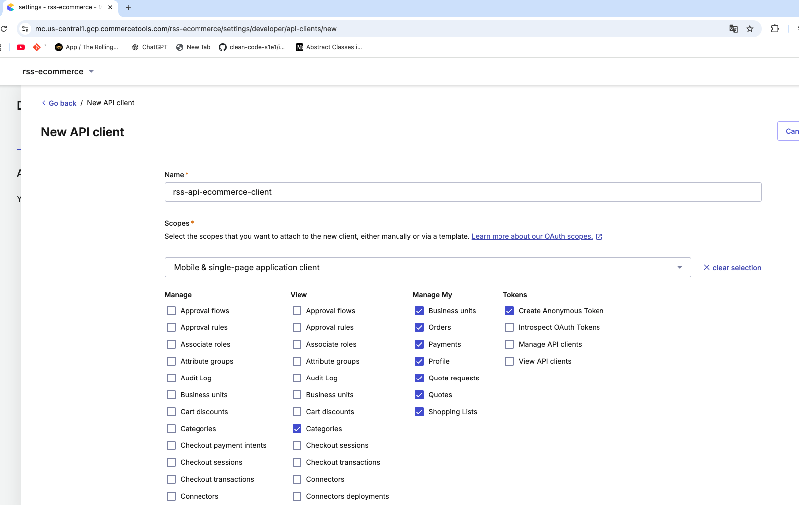
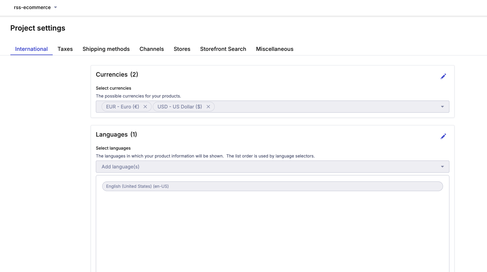
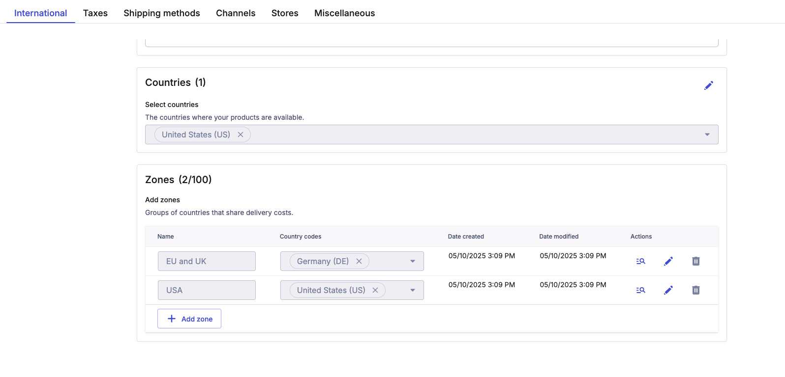
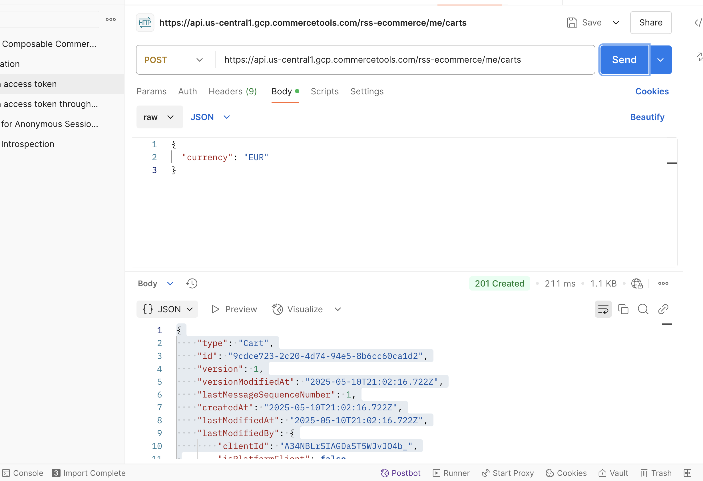
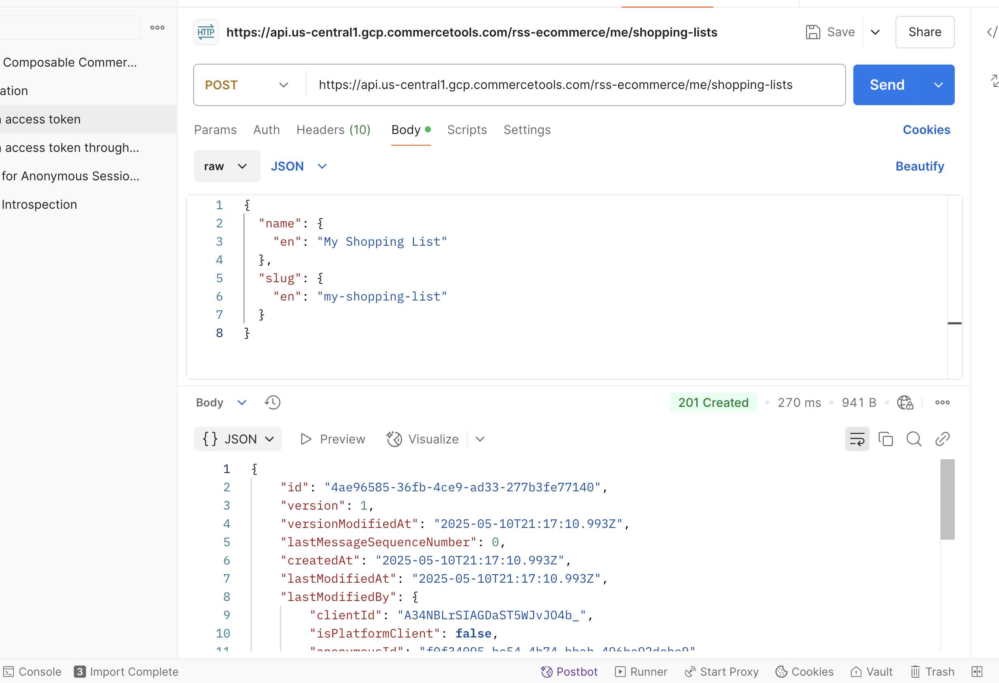
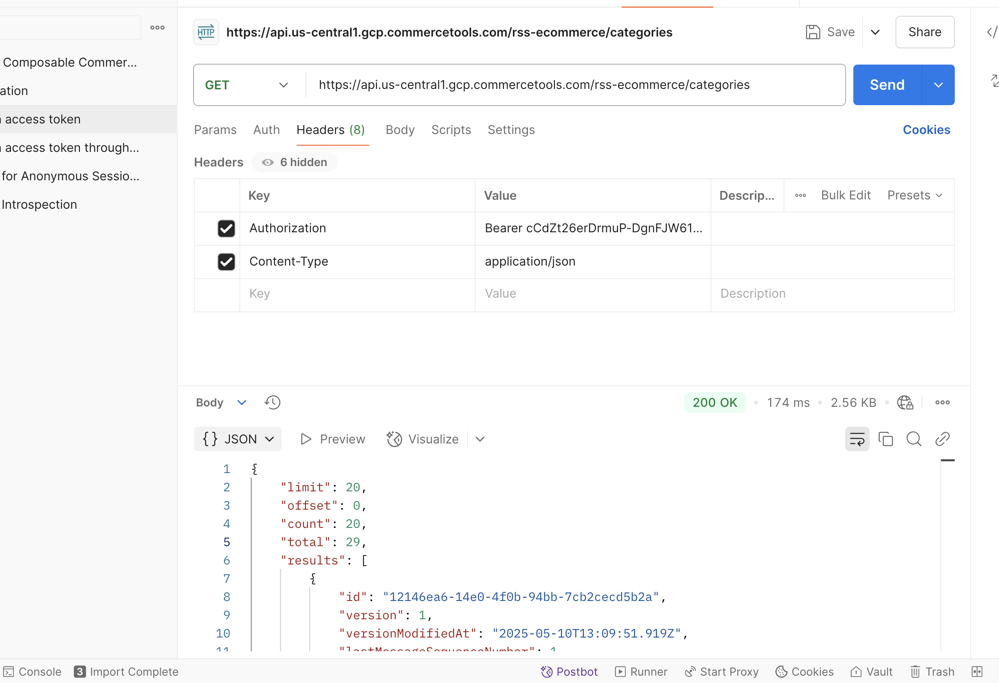
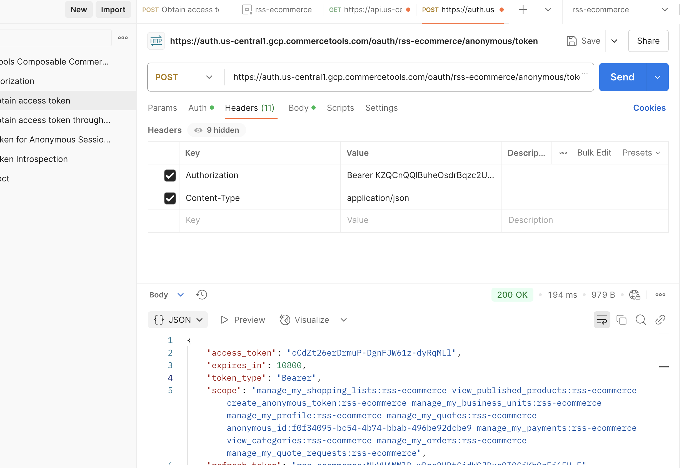
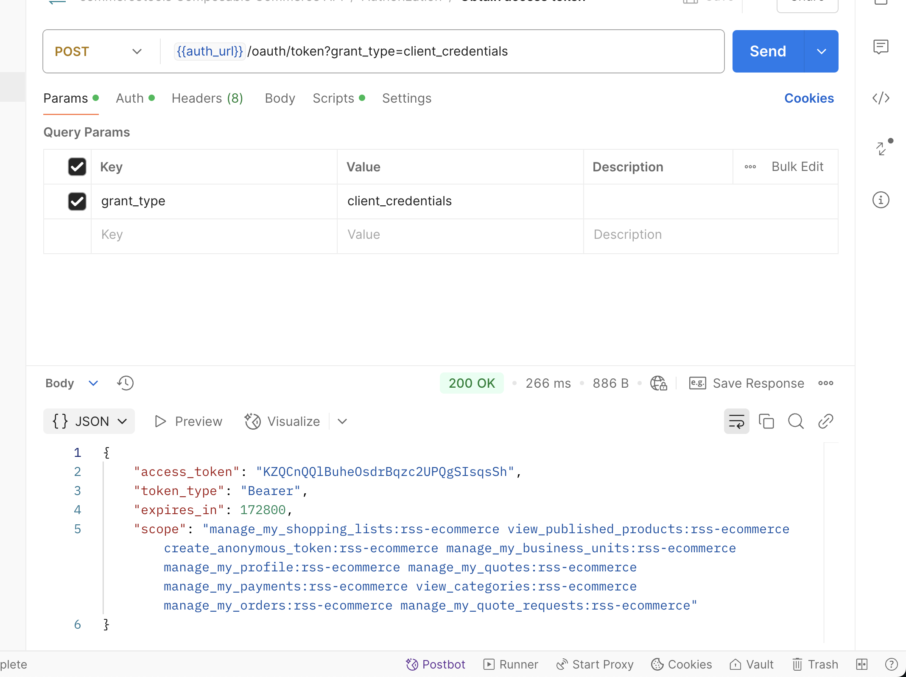

# 🛍️ RSS E-Commerce Task

This is the final project for the [RS School Frontend Course](https://rs.school/) — a fully functional, single-page **E-Commerce web application** built with **React** and **Webpack**

## Latest Updates

- Added mock data mode for products/categories to run the app without commercetools credentials.
- Added MongoDB-backed mock auth server for register/login/profile/password flows.
- Added persistent cart storage in MongoDB for logged-in users.
- Added promo code support in mock cart flow (`PROMO20`) with cart restore after login.
- Updated cart checkout UX:
  - If user is not authenticated, `Proceed to Checkout` redirects to login.
  - After login, user returns to cart and checkout opens an `under construction` modal.

## Getting Started
1. Install [Node.js](https://nodejs.org/en)
2. Clone this repository
3. Use `npm install` to install all dependencies
4. Create env file from `.env.example`:
  - copy `.env.example` to `.env.development.local`
  - fill required values
5. Run backend and frontend (separate terminals):
  - backend: `npm run auth-server`
  - frontend: `npm run start-3000`
6. Open `http://localhost:3000`

## Environment Variables

Use `.env.development.local` for local development:

```env
REACT_APP_USE_MOCK_DATA=true
REACT_APP_USE_MOCK_AUTH_DB=true
REACT_APP_MOCK_AUTH_API_URL=http://localhost:4000/api

MONGODB_URI=your_mongodb_connection_string
MOCK_AUTH_JWT_SECRET=your_jwt_secret
MOCK_AUTH_PORT=4000
```

Notes:
- Frontend reads `REACT_APP_*` variables.
- Auth server reads `MONGODB_URI`, `MOCK_AUTH_JWT_SECRET`, `MOCK_AUTH_PORT`.

## 📜 Available Scripts

The following NPM scripts are available for development and maintenance:

| Command             | Description                                              |
|---------------------|----------------------------------------------------------|
| `npm start`         | Start dev server with Hot Module Replacement (HMR)       |
| `npm run start-3000`| Start dev server on port 3000                            |
| `npm run dev`       | Build the project in development mode                    |
| `npm run auth-server`| Start MongoDB mock auth backend (`server/mock-auth-server.js`) |
| `npm run prod`      | Build the project in production mode                     |
| `npm run lint`      | Run ESLint on `.ts` and `.tsx` files                     |
| `npm run prettier`  | Format source files using Prettier                       |
| `npm test`          | Run unit tests using Jest                                |

## Local Run (Current Recommended Flow)

1. Terminal A (backend):
   - Set server env vars (PowerShell) or via `.env` tooling.
   - Run: `npm run auth-server`
2. Terminal B (frontend):
   - Run: `npm run start-3000`
3. Visit `http://localhost:3000`

If backend is not running and `REACT_APP_USE_MOCK_AUTH_DB=true`, login/register/profile requests to `http://localhost:4000/api` will fail.

## Backend Deployment Notes

- Deploy from project root (recommended), since dependencies and scripts are in root `package.json`.
- Start command: `npm run auth-server` (or `node server/mock-auth-server.js`).
- Configure env vars in hosting dashboard (not local `$env:` commands):
  - `MONGODB_URI`
  - `MOCK_AUTH_JWT_SECRET`
  - `MOCK_AUTH_PORT` (or adapt server to use platform `PORT` first)
- After backend deploy, update frontend:
  - `REACT_APP_MOCK_AUTH_API_URL=https://your-backend-domain/api`


## 3. CommerceTools Project and API Client Setup (30 points) 💻

### ✅ RSS-ECOMM-1_06 – Create CommerceTools Project (15 points) 💼

A new project named `rss-ecommerce` was successfully created in the [CommerceTools Merchant Center](https://mc.commercetools.com/).

Configured settings:
- **Currency**: EUR, $Doll$
- **Language**: en
- **Country**: EU, US
- **Zone**: Europe

Other configurations such as Taxes, Channels, and Shipping Methods are intentionally not set at this stage, as they will be handled in later sprints.

📷 _Project settings confirmation:_





---

### ✅ RSS-ECOMM-1_07 – Create API Client (15 points) 🔐

An API client was created using the **"Mobile & Single-Page Application"** preset.

All required OAuth scopes were enabled and tested individually via Postman:

#### ✅ Scope Confirmation Screenshots:

- **`manage_my_orders`**
  
    
  🟢 Created cart via `/me/carts` — confirms `manage_my_orders`

- **`manage_my_shopping_lists`**

    
  🟢 Created shopping list via `/me/shopping-lists` — confirms `manage_my_shopping_lists`

- **`view_published_products`**

    
  🟢 Retrieved products via `/product-projections` — confirms `view_published_products`

- **`view_categories`**

    
  🟢 Retrieved categories via `/categories` — confirms `view_categories`

- **`create_anonymous_token`**

    
  🟢 Successfully retrieved anonymous token — confirms `create_anonymous_token`

Verified client credentials using Postman:
- Sent a `POST` request to `https://auth.us-central1.gcp.commercetools.com/oauth/token`
- Used **Basic Auth** with `client_id` and `client_secret`
- Passed `grant_type=client_credentials` and full `scope`

📷 _Successful token request (200 OK):_




🎯 Result: API client successfully created and tested.
All required scopes are verified via Postman and returned expected responses.
